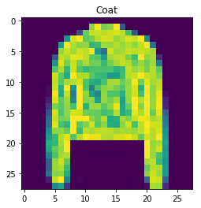
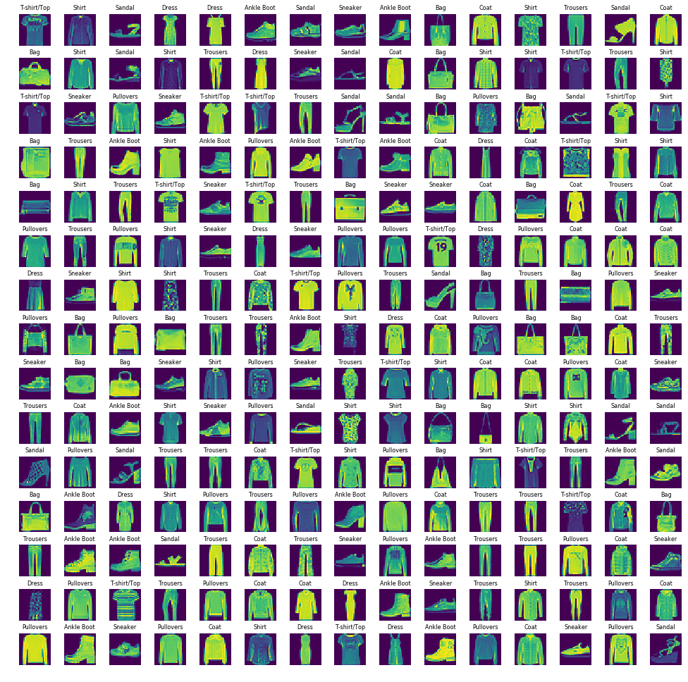
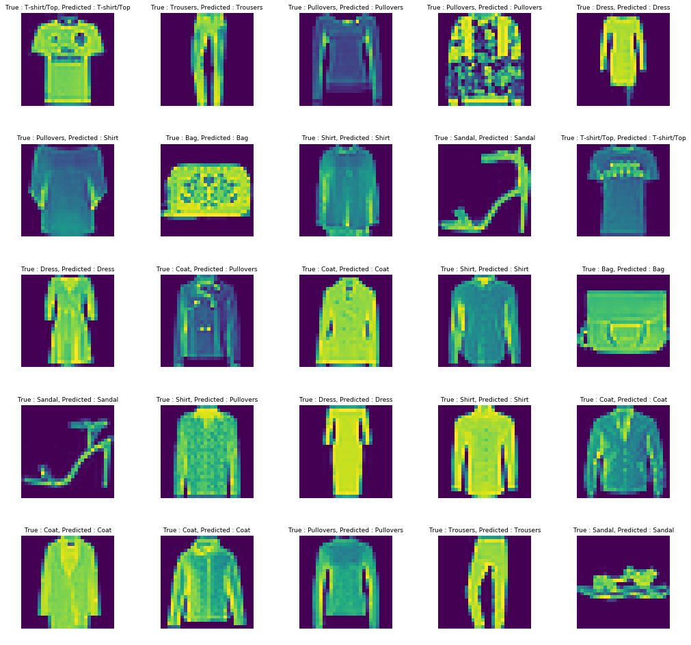
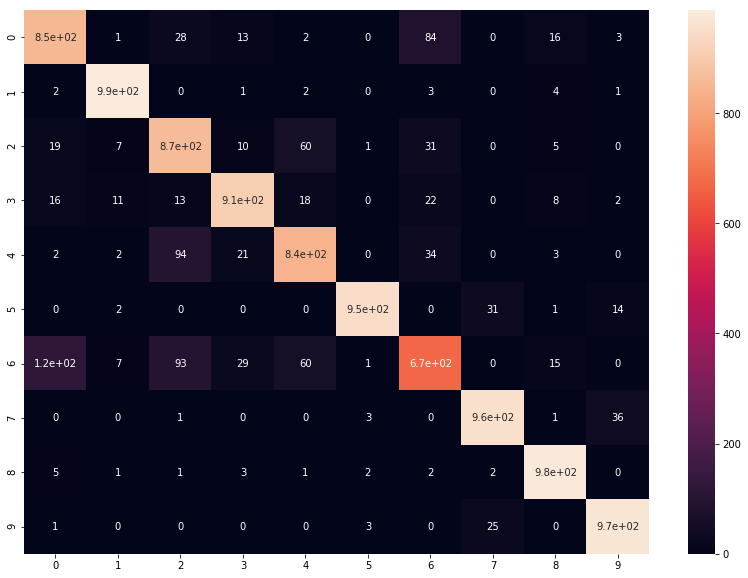

# Fashion Classification

In this session we are going to classify from a dataset what types of clothing accessories are recognised in an image.

- Our training set consists of 70,000 images and we'll divide them into 60,000 training images and 10,000 test images, these images are coverted into gray scale and are available in size of 28x28 pixels
- We have converted one image into gray scale and flatten it's values of 784 pixels (28x28) in a row

There are 10 classes :
0 => T-shirt/Top
1 => Trousers
2 => Pullovers
3 => Dress 
4 => Coat
5 => Sandal
6 => Shirt
7 => Sneaker
8 => Bag
9 => Ankle Boot


## Importing our basic Libraries


```python
import numpy as np
import pandas as pd
import matplotlib.pyplot as plt
import seaborn as sns
```

## Importing our Fashion Classification Training and Testing Dataset


```python
fashion_train_df = pd.read_csv('input/fashion-mnist_train.csv', sep=',')
fashion_test_df = pd.read_csv('input/fashion-mnist_test.csv', sep=',')
```


```python
fashion_train_df.head()
```


<div>
<style scoped>
    .dataframe tbody tr th:only-of-type {
        vertical-align: middle;
    }

    .dataframe tbody tr th {
        vertical-align: top;
    }

    .dataframe thead th {
        text-align: right;
    }
</style>
<table border="1" class="dataframe">
  <thead>
    <tr style="text-align: right;">
      <th></th>
      <th>label</th>
      <th>pixel1</th>
      <th>pixel2</th>
      <th>pixel3</th>
      <th>pixel4</th>
      <th>pixel5</th>
      <th>pixel6</th>
      <th>pixel7</th>
      <th>pixel8</th>
      <th>pixel9</th>
      <th>...</th>
      <th>pixel775</th>
      <th>pixel776</th>
      <th>pixel777</th>
      <th>pixel778</th>
      <th>pixel779</th>
      <th>pixel780</th>
      <th>pixel781</th>
      <th>pixel782</th>
      <th>pixel783</th>
      <th>pixel784</th>
    </tr>
  </thead>
  <tbody>
    <tr>
      <th>0</th>
      <td>2</td>
      <td>0</td>
      <td>0</td>
      <td>0</td>
      <td>0</td>
      <td>0</td>
      <td>0</td>
      <td>0</td>
      <td>0</td>
      <td>0</td>
      <td>...</td>
      <td>0</td>
      <td>0</td>
      <td>0</td>
      <td>0</td>
      <td>0</td>
      <td>0</td>
      <td>0</td>
      <td>0</td>
      <td>0</td>
      <td>0</td>
    </tr>
    <tr>
      <th>1</th>
      <td>9</td>
      <td>0</td>
      <td>0</td>
      <td>0</td>
      <td>0</td>
      <td>0</td>
      <td>0</td>
      <td>0</td>
      <td>0</td>
      <td>0</td>
      <td>...</td>
      <td>0</td>
      <td>0</td>
      <td>0</td>
      <td>0</td>
      <td>0</td>
      <td>0</td>
      <td>0</td>
      <td>0</td>
      <td>0</td>
      <td>0</td>
    </tr>
    <tr>
      <th>2</th>
      <td>6</td>
      <td>0</td>
      <td>0</td>
      <td>0</td>
      <td>0</td>
      <td>0</td>
      <td>0</td>
      <td>0</td>
      <td>5</td>
      <td>0</td>
      <td>...</td>
      <td>0</td>
      <td>0</td>
      <td>0</td>
      <td>30</td>
      <td>43</td>
      <td>0</td>
      <td>0</td>
      <td>0</td>
      <td>0</td>
      <td>0</td>
    </tr>
    <tr>
      <th>3</th>
      <td>0</td>
      <td>0</td>
      <td>0</td>
      <td>0</td>
      <td>1</td>
      <td>2</td>
      <td>0</td>
      <td>0</td>
      <td>0</td>
      <td>0</td>
      <td>...</td>
      <td>3</td>
      <td>0</td>
      <td>0</td>
      <td>0</td>
      <td>0</td>
      <td>1</td>
      <td>0</td>
      <td>0</td>
      <td>0</td>
      <td>0</td>
    </tr>
    <tr>
      <th>4</th>
      <td>3</td>
      <td>0</td>
      <td>0</td>
      <td>0</td>
      <td>0</td>
      <td>0</td>
      <td>0</td>
      <td>0</td>
      <td>0</td>
      <td>0</td>
      <td>...</td>
      <td>0</td>
      <td>0</td>
      <td>0</td>
      <td>0</td>
      <td>0</td>
      <td>0</td>
      <td>0</td>
      <td>0</td>
      <td>0</td>
      <td>0</td>
    </tr>
  </tbody>
</table>
<p>5 rows × 785 columns</p>
</div>


```python
fashion_train_df.shape
```


    (60000, 785)


## Converting our Datasets into numpy arrays


```python
training = np.array(fashion_train_df, dtype='float32')
testing = np.array(fashion_test_df, dtype='float32')
```

## Plotting our dataset tuples into a graph
- First let's import random tuples from our dataset
- We'll be skipping the label in our plot function.
- We will use the imshow function of matplot library
- Also resphaping our array back into it's original form i.e 28x28


```python
import random
labels = {0 : 'T-shirt/Top',1 : 'Trousers',2 : 'Pullovers',3 : 'Dress' ,4 : 'Coat',5 : 'Sandal',6 : 'Shirt',7 : 'Sneaker',8 : 'Bag'
,9 : 'Ankle Boot'}
number = random.randint(1,60000)
plt.title(f'{labels[training[number,0]]}')
plt.imshow(training[number, 1:].reshape(28,28))
```


    <matplotlib.image.AxesImage at 0x1a4ea738d0>





- Let us view our data in a grid format to understand our data set
- We'll create a grid of 15x15 to plot our categories of clothing
- This grid will have images with figure size 0f 17 by 17 
- It will randomly pick 255 tuples from the dataset


```python
W_grid = 15
L_grid =15

fig,axes = plt.subplots(W_grid, L_grid, figsize = (17,17))

axes = axes.ravel() #Flatten our 15x15 matrix into array of 255

len_training = len(training)
    
for i in np.arange(0, W_grid * L_grid):
    index = random.randint(0, len_training)
    axes[i].imshow(training[index, 1:].reshape(28,28))
    axes[i].set_title(f'{labels[training[index,0]]}', fontsize = 8)
    axes[i].axis('off')
    
plt.subplots_adjust(hspace=0.4)    
```





## Our first step is to divide our data into Training and Test sets


```python
X_train = training[:,1:]/255 # We are doing so in order to Normalise our data for better computation
y_train = training[:, 0]
```


```python
X_test = testing[:,1:]/255 # We are doing so in order to Normalise our data for better computation
y_test = testing[:, 0]
```


```python
from sklearn.model_selection import train_test_split
X_train,X_validate,y_train,y_validate = train_test_split(X_train,y_train, test_size = 0.2, random_state= 12345)
```

- Reshaping our training and test data into the size of 28x28


```python
X_train = X_train.reshape(X_train.shape[0], *(28,28,1))
X_test = X_test.reshape(X_test.shape[0], *(28,28,1))
X_validate = X_validate.reshape(X_validate.shape[0], *(28,28,1))
```


```python
X_train[1,:,:].shape
```


    (28, 28, 1)


```python
import keras
from keras.models import Sequential
from keras.layers import Conv2D,MaxPooling2D, Dropout, Dense, Flatten
from keras.optimizers import Adam
from keras.callbacks import TensorBoard
```

#### We'll add a Convolutional layer which will apply 32 feature maps on each and every one of our tuple


```python
cnn_model = Sequential()
cnn_model.add(Conv2D(32,3,3, input_shape = (28,28,1), activation = 'relu'))
```

    /Users/parthkotecha/anaconda3/lib/python3.6/site-packages/ipykernel_launcher.py:2: UserWarning: Update your `Conv2D` call to the Keras 2 API: `Conv2D(32, (3, 3), input_shape=(28, 28, 1..., activation="relu")`
      


#### Now adding a Max Pooling layer which will minimise our tuple into a 2x2 image preserving all the important features


```python
cnn_model.add(MaxPooling2D(pool_size = (2,2)))
```

#### Now our data is ready to be fed into a fully connected ANN but before that we need to flatten our matrix.


```python
cnn_model.add(Flatten())
```

#### Here we'll feed our points into the ANN with 32 hidden layers and gives us back an output of 11 according to our labels


```python
cnn_model.add(Dense(output_dim = 32, activation = 'relu'))
cnn_model.add(Dense(output_dim = 11, activation = 'sigmoid'))
```

    /Users/parthkotecha/anaconda3/lib/python3.6/site-packages/ipykernel_launcher.py:1: UserWarning: Update your `Dense` call to the Keras 2 API: `Dense(activation="relu", units=32)`
      """Entry point for launching an IPython kernel.
    /Users/parthkotecha/anaconda3/lib/python3.6/site-packages/ipykernel_launcher.py:2: UserWarning: Update your `Dense` call to the Keras 2 API: `Dense(activation="sigmoid", units=11)`
      


#### In this step we'll apply the loss function considering that our outputs have multiple categories with an optimizer function and at the end fit our model


```python
cnn_model.compile(loss= 'sparse_categorical_crossentropy', optimizer = Adam(lr = 0.01), metrics= ['accuracy'])
epochs = 50
cnn_model.fit(X_train,y_train, batch_size=512, nb_epoch = epochs, verbose=1,validation_data=(X_validate,y_validate))
```

    /Users/parthkotecha/anaconda3/lib/python3.6/site-packages/ipykernel_launcher.py:3: UserWarning: The `nb_epoch` argument in `fit` has been renamed `epochs`.
      This is separate from the ipykernel package so we can avoid doing imports until


    Train on 48000 samples, validate on 12000 samples
    Epoch 1/50
    48000/48000 [==============================] - 24s 495us/step - loss: 0.7838 - acc: 0.6267 - val_loss: 0.3728 - val_acc: 0.8633
    Epoch 2/50
    48000/48000 [==============================] - 24s 508us/step - loss: 0.3283 - acc: 0.8827 - val_loss: 0.2950 - val_acc: 0.8928
    Epoch 3/50
    48000/48000 [==============================] - 24s 510us/step - loss: 0.2827 - acc: 0.8994 - val_loss: 0.2839 - val_acc: 0.8976
    Epoch 4/50
    48000/48000 [==============================] - 24s 497us/step - loss: 0.2520 - acc: 0.9094 - val_loss: 0.2687 - val_acc: 0.9044
    Epoch 5/50
    48000/48000 [==============================] - 23s 484us/step - loss: 0.2236 - acc: 0.9188 - val_loss: 0.2652 - val_acc: 0.9026
    Epoch 6/50
    48000/48000 [==============================] - 24s 497us/step - loss: 0.2078 - acc: 0.9237 - val_loss: 0.3033 - val_acc: 0.8947
    Epoch 7/50
    48000/48000 [==============================] - 24s 494us/step - loss: 0.1959 - acc: 0.9287 - val_loss: 0.2748 - val_acc: 0.9050
    Epoch 8/50
    48000/48000 [==============================] - 25s 516us/step - loss: 0.1705 - acc: 0.9373 - val_loss: 0.2667 - val_acc: 0.9112
    Epoch 9/50
    48000/48000 [==============================] - 24s 493us/step - loss: 0.1586 - acc: 0.9402 - val_loss: 0.2911 - val_acc: 0.9088
    Epoch 10/50
    48000/48000 [==============================] - 23s 473us/step - loss: 0.1472 - acc: 0.9450 - val_loss: 0.2976 - val_acc: 0.9080
    Epoch 11/50
    48000/48000 [==============================] - 21s 441us/step - loss: 0.1389 - acc: 0.9472 - val_loss: 0.3151 - val_acc: 0.9028
    Epoch 12/50
    48000/48000 [==============================] - 22s 455us/step - loss: 0.1284 - acc: 0.9510 - val_loss: 0.3012 - val_acc: 0.9105
    Epoch 13/50
    48000/48000 [==============================] - 21s 443us/step - loss: 0.1157 - acc: 0.9558 - val_loss: 0.3130 - val_acc: 0.9073
    Epoch 14/50
    48000/48000 [==============================] - 21s 437us/step - loss: 0.1089 - acc: 0.9593 - val_loss: 0.3324 - val_acc: 0.9074
    Epoch 15/50
    48000/48000 [==============================] - 21s 443us/step - loss: 0.1028 - acc: 0.9609 - val_loss: 0.3301 - val_acc: 0.9096
    Epoch 16/50
    48000/48000 [==============================] - 21s 444us/step - loss: 0.0922 - acc: 0.9656 - val_loss: 0.3470 - val_acc: 0.9078
    Epoch 17/50
    48000/48000 [==============================] - 21s 444us/step - loss: 0.0868 - acc: 0.9675 - val_loss: 0.3576 - val_acc: 0.9079
    Epoch 18/50
    48000/48000 [==============================] - 21s 442us/step - loss: 0.0827 - acc: 0.9683 - val_loss: 0.3761 - val_acc: 0.9095
    Epoch 19/50
    48000/48000 [==============================] - 21s 440us/step - loss: 0.0743 - acc: 0.9715 - val_loss: 0.3862 - val_acc: 0.9091
    Epoch 20/50
    48000/48000 [==============================] - 21s 441us/step - loss: 0.0717 - acc: 0.9726 - val_loss: 0.3970 - val_acc: 0.9049
    Epoch 21/50
    48000/48000 [==============================] - 21s 444us/step - loss: 0.0703 - acc: 0.9721 - val_loss: 0.4162 - val_acc: 0.9101
    Epoch 22/50
    48000/48000 [==============================] - 21s 437us/step - loss: 0.0705 - acc: 0.9737 - val_loss: 0.4289 - val_acc: 0.9071
    Epoch 23/50
    48000/48000 [==============================] - 21s 438us/step - loss: 0.0714 - acc: 0.9722 - val_loss: 0.4240 - val_acc: 0.9079
    Epoch 24/50
    48000/48000 [==============================] - 21s 435us/step - loss: 0.0641 - acc: 0.9749 - val_loss: 0.4561 - val_acc: 0.9048
    Epoch 25/50
    48000/48000 [==============================] - 22s 450us/step - loss: 0.0605 - acc: 0.9758 - val_loss: 0.4477 - val_acc: 0.9065
    Epoch 26/50
    48000/48000 [==============================] - 21s 438us/step - loss: 0.0559 - acc: 0.9780 - val_loss: 0.4494 - val_acc: 0.9076
    Epoch 27/50
    48000/48000 [==============================] - 21s 437us/step - loss: 0.0447 - acc: 0.9823 - val_loss: 0.4957 - val_acc: 0.9066
    Epoch 28/50
    48000/48000 [==============================] - 21s 435us/step - loss: 0.0493 - acc: 0.9803 - val_loss: 0.5009 - val_acc: 0.8982
    Epoch 29/50
    48000/48000 [==============================] - 22s 456us/step - loss: 0.0470 - acc: 0.9817 - val_loss: 0.4975 - val_acc: 0.9081
    Epoch 30/50
    48000/48000 [==============================] - 22s 453us/step - loss: 0.0401 - acc: 0.9839 - val_loss: 0.4835 - val_acc: 0.9076
    Epoch 31/50
    48000/48000 [==============================] - 21s 434us/step - loss: 0.0399 - acc: 0.9846 - val_loss: 0.5124 - val_acc: 0.9073
    Epoch 32/50
    48000/48000 [==============================] - 22s 458us/step - loss: 0.0442 - acc: 0.9835 - val_loss: 0.5189 - val_acc: 0.9047
    Epoch 33/50
    48000/48000 [==============================] - 22s 448us/step - loss: 0.0450 - acc: 0.9820 - val_loss: 0.5581 - val_acc: 0.9006
    Epoch 34/50
    48000/48000 [==============================] - 21s 443us/step - loss: 0.0493 - acc: 0.9809 - val_loss: 0.5224 - val_acc: 0.9081
    Epoch 35/50
    48000/48000 [==============================] - 23s 474us/step - loss: 0.0376 - acc: 0.9850 - val_loss: 0.5343 - val_acc: 0.9071
    Epoch 36/50
    48000/48000 [==============================] - 25s 526us/step - loss: 0.0393 - acc: 0.9848 - val_loss: 0.5314 - val_acc: 0.9022
    Epoch 37/50
    48000/48000 [==============================] - 22s 468us/step - loss: 0.0312 - acc: 0.9874 - val_loss: 0.5554 - val_acc: 0.9069
    Epoch 38/50
    48000/48000 [==============================] - 21s 439us/step - loss: 0.0259 - acc: 0.9896 - val_loss: 0.5657 - val_acc: 0.9050
    Epoch 39/50
    48000/48000 [==============================] - 21s 439us/step - loss: 0.0371 - acc: 0.9857 - val_loss: 0.6033 - val_acc: 0.9022
    Epoch 40/50
    48000/48000 [==============================] - 21s 440us/step - loss: 0.0358 - acc: 0.9857 - val_loss: 0.5686 - val_acc: 0.9068
    Epoch 41/50
    48000/48000 [==============================] - 21s 430us/step - loss: 0.0393 - acc: 0.9843 - val_loss: 0.5836 - val_acc: 0.9038
    Epoch 42/50
    48000/48000 [==============================] - 21s 444us/step - loss: 0.0335 - acc: 0.9864 - val_loss: 0.5902 - val_acc: 0.9046
    Epoch 43/50
    48000/48000 [==============================] - 22s 451us/step - loss: 0.0323 - acc: 0.9872 - val_loss: 0.5665 - val_acc: 0.9068
    Epoch 44/50
    48000/48000 [==============================] - 21s 436us/step - loss: 0.0316 - acc: 0.9884 - val_loss: 0.6175 - val_acc: 0.8995
    Epoch 45/50
    48000/48000 [==============================] - 21s 442us/step - loss: 0.0318 - acc: 0.9879 - val_loss: 0.6077 - val_acc: 0.9012
    Epoch 46/50
    48000/48000 [==============================] - 21s 441us/step - loss: 0.0327 - acc: 0.9873 - val_loss: 0.5917 - val_acc: 0.9018
    Epoch 47/50
    48000/48000 [==============================] - 22s 463us/step - loss: 0.0365 - acc: 0.9852 - val_loss: 0.6240 - val_acc: 0.9041
    Epoch 48/50
    48000/48000 [==============================] - 25s 514us/step - loss: 0.0336 - acc: 0.9871 - val_loss: 0.6143 - val_acc: 0.9043
    Epoch 49/50
    48000/48000 [==============================] - 24s 505us/step - loss: 0.0333 - acc: 0.9872 - val_loss: 0.6034 - val_acc: 0.9082
    Epoch 50/50
    48000/48000 [==============================] - 22s 462us/step - loss: 0.0275 - acc: 0.9884 - val_loss: 0.6465 - val_acc: 0.9028


    <keras.callbacks.History at 0x1a22aed4a8>


## Now as Our model is done training we can move on to evalute and check how it performed


```python
evalutaion = cnn_model.evaluate(X_test,y_test)
print(f'Test Accuracy : {evalutaion[1]}')
```

    10000/10000 [==============================] - 2s 234us/step
    Test Accuracy : 0.9


```python
predicted_classes = cnn_model.predict_classes(X_test)
```

## Now as before We'll create a subplot to visually rectify how our CNN Model performed


```python
W = 5
L = 5

fig, axes = plt.subplots(W,L, figsize=(17,17))

axes = axes.ravel()

for i in np.arange(0, W*L):
    axes[i].imshow(X_test[i].reshape(28,28))
    axes[i].set_title(f'True : {labels[y_test[i]]}, Predicted : {labels[predicted_classes[i]]}', fontsize = 9)
    axes[i].axis('off')
    
plt.subplots_adjust(wspace= 0.5)    
```





## Now creating a confusion matrix and implementing it in our seaborn heatmap to check out our true predictions


```python
from sklearn.metrics import confusion_matrix
cm = confusion_matrix(y_test,predicted_classes)
plt.figure(figsize = (14,10))
sns.heatmap(cm , annot = True)
```


    <matplotlib.axes._subplots.AxesSubplot at 0x1a700721d0>





## Now we'll create a classification report to check which class was identified more accrately then other classes


```python
from sklearn.metrics import classification_report
target_names = [f"{labels[predicted_classes[i]]}" for i in range(0, len(labels.keys()))]
print(classification_report(y_test, predicted_classes, target_names= target_names))
```

                  precision    recall  f1-score   support
    
     T-shirt/Top       0.84      0.85      0.84      1000
        Trousers       0.97      0.99      0.98      1000
       Pullovers       0.79      0.87      0.83      1000
       Pullovers       0.92      0.91      0.92      1000
           Dress       0.86      0.84      0.85      1000
           Shirt       0.99      0.95      0.97      1000
             Bag       0.79      0.67      0.73      1000
           Shirt       0.94      0.96      0.95      1000
          Sandal       0.95      0.98      0.97      1000
     T-shirt/Top       0.95      0.97      0.96      1000
    
       micro avg       0.90      0.90      0.90     10000
       macro avg       0.90      0.90      0.90     10000
    weighted avg       0.90      0.90      0.90     10000
    


## The average of our model turned out to be 90% so, I guess that's pretty good.
